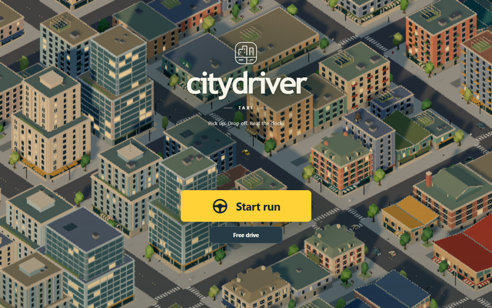
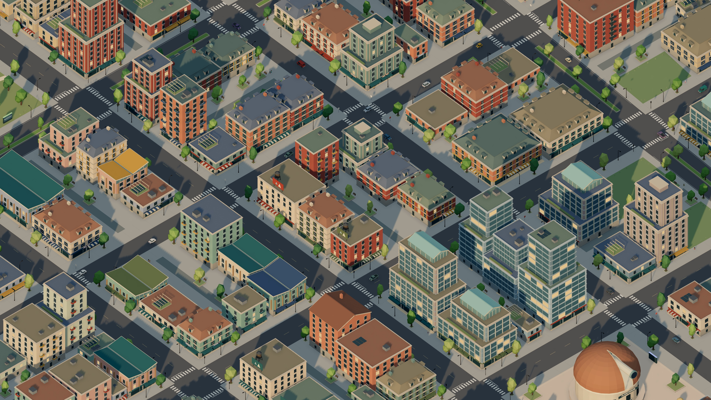
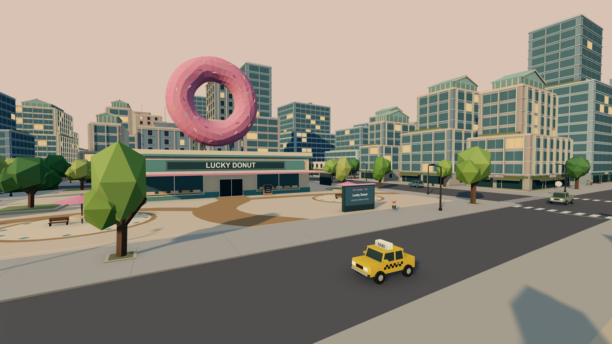

# Citydriver

Taxi driving game built with [Three.js](https://threejs.org/). The city generates as you drive.



| City overview | Lucky Donut |
| --- | --- |
|  |  |

## How to play

Start a **Taxi run** to pick up passengers and earn money. You start with 90 seconds. Stop in a pickup ring, follow the arrow, then stop in the yellow drop-off ring before the fare clock runs out.

Picking up adds 6 seconds per rider, and every drop-off adds 8–20 seconds, more for longer rides, plus an arrival bonus. Each rider's rating window runs green, then yellow, then red: arrive on green for **Speedy** (+5 s), on yellow for **Normal** (+2 s), or on red for **Slow** (no bonus). The shift clock holds up to 180 seconds. Groups earn time for every rider, so a full cab is the best way to stay on the clock. Fares pay by distance, plus a time bonus for the clock left on arrival. Drifts and near misses on the way earn tips that grow with each trick in a combo and multiply by the riders aboard; circling for tips earns nothing, and crashes halve your current tips. Boost recharges when released. Resetting costs 5 seconds.

Choose your own fare by stopping in any passenger ring. A new ring never waits where your last rider got out. The ring's color shows how far the job goes: red for a quick hop, then orange and yellow, up to green for a long ride that pays the most. Pick up a solo rider or a group of 2–4; everyone boards together and every rider has their own destination. Approach a ring to preview the distance, riders, stops, and fare; the preview warns when your shift clock probably can't cover the fare at an easy pace. Numbers on the map show group size, which is also the number of stops.

Once passengers board, a green 3D arrow points to the current drop-off and automatically advances as each rider gets out, carrying on in the same general direction rather than doubling back. A dashed map route previews the next stop. Groups pay more and refill a quarter of your boost at each stop, but as in Crazy Taxi 2 they pay only when everyone arrives: the whole fare, tips and a $25 bonus per extra rider land at the last stop, and if the clock runs out first the group pays nothing. A group shares one clock. Each rider adds their own time as the one before gets out, so time saved early carries forward, and every stop is rated on that rider's own leg. You carry one party at a time; boarding never takes longer for a group. Your best score and fleet balance save locally. Pause or switch tabs to stop the clock.

When the shift ends you earn a license for your total: Class E at $250, then D, C, B, A and S, each at double the last, and Legend at $16,000. The results screen shows how much more the next class needs.

Buy the GT Taxi ($1,500) or Formula Taxi ($4,500) from **Pause → Taxi fleet** or the results screen. Completed fares stay banked even if you restart. Vehicle changes apply to the next run.

**Free drive** has no timer. All three taxis are available in the garage, along with weather settings and city discoveries in the pause menu. Press forward on the main menu to enter free drive, or **R** to generate a new city.

## Controls

| Action | Keyboard | Controller |
| --- | --- | --- |
| Accelerate | W / Up | RT / R2 or A / Cross |
| Brake / reverse | S / Down | LT / L2 or B / Circle |
| Steer | A D / Left Right | Left stick |
| Boost | Shift | RB / R1 |
| Drift / handbrake | Space | D-pad Down |
| Camera | V | X / Square |
| Pause | P / Escape | Start / Menu |
| Reset | R | Y / Triangle |
| Garage / Taxi fleet | C / G | L3 |
| Autodrive (free drive) | H | D-pad Up |
| Fullscreen | F | LB / L1 |
| Sound | M | Pause menu |

On touch screens, use the stick to drive, hold Boost, and tap Drift while steering in chase view. Release the stick to stop.

Slow down for tight turns. Tap Drift while steering, then keep accelerating and steering to carry the slide. Straighten, countersteer, lift off, or brake to regain grip. Faster driving gives wider turns and finer steering corrections.

In taxi mode, holding brake briefly stops the cab before reversing so passengers can board or exit. Release and press brake again to reverse immediately.

## Run locally

Requires Node.js 22.12 or newer.

```sh
npm install
npm run dev
```

Use `?seed=4817` to load the same city again. Run `npm run build` for a production build.

[Desktop setup](ELECTRON.md) · [Offline installation](PWA.md) · [Taxi stats](docs/taxi-fleet.md) · [Development notes](docs/)

## Tests

```sh
npm test
npm run build
npm run test:browser
npm run test:taxi
npm run test:fleet
npm run test:layout
npm run test:spaces
npm run test:performance
npm run test:pwa
```

Browser tests require a running dev server. Set `TEST_URL` to use another URL or `CHROME_PATH` to use another Chrome executable.

Run `npm run benchmark` for rendering and streaming measurements, or `npm run benchmark:cpu` for CPU profiling. See [performance notes](docs/performance.md).

## GitHub Pages

In **Settings → Pages**, set **Source** to **GitHub Actions**. The workflow tests pull requests and deploys successful builds from `main` using `/citydriver/` as the base path.

Commit `package-lock.json` when dependencies change. If `npm ci` reports missing lockfile entries:

```sh
npx --yes --package=npm@11.19.1 npm install --package-lock-only --ignore-scripts
npx --yes --package=npm@11.19.1 npm ci --dry-run --ignore-scripts
```
